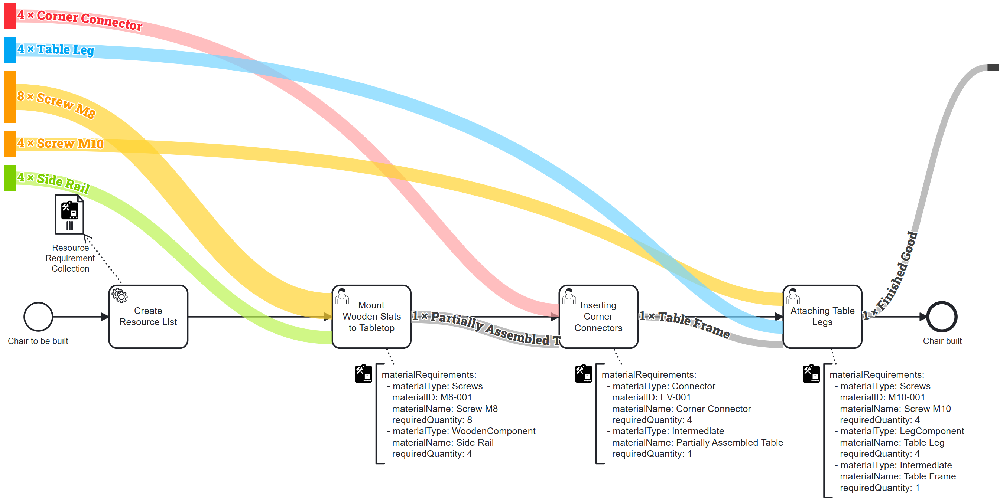

# PRiME Material Flow

A Camunda plugin for visualizing material flows in business processes, part of PRiME (Passive Resource-integrated Modeling Extension) extension.

## Overview



PRiME Material Flow is a visualization tool that bridges the gap between digital process models and physical resource orchestration in Business Process Management (BPM). It extends Camunda's capabilities to provide:

- Visualization of material flows in business processes
- Design-time analysis of material requirements
- Clear representation of material consumption and production
- Support for tracking both consumable materials and reusable tools

## Features

- **Material Flow Visualization**: Interactive Sankey diagrams showing material movement through process tasks
- **Resource Management**: Track both consumable materials and reusable tools
- **Design-Time Analysis**: Identify material requirements and dependencies before execution
- **Camunda Integration**: Seamlessly integrates with Camunda Cockpit
- **Flexible Annotation**: Supports both JSON and YAML formats for material specifications

## Installation

1. Clone this repository
2. Start the application
    ```bash
    ./gradlew bootRun
    ```
3. Open Camunda Cockpit at http://localhost:8080/ (admin:admin) and navigate to deployed processes 

## Usage

1. Annotate your BPMN processes with material requirements using the PRiME extension
2. Deploy your process to Camunda
3. Access the Material Flow visualization through the Camunda Cockpit

### Example Material Annotation

```json
{
  "materialRequirements": [
    {
      "id": "screw_m10",
      "name": "Screw M10",
      "type": "consumable",
      "quantity": 4,
      "unit": "pcs"
    },
    {
      "id": "table_leg",
      "name": "Table Leg",
      "type": "consumable",
      "quantity": 4,
      "unit": "pcs"
    }
  ]
}
```

or 

```yaml
materialRequirements:
  - id: screw_m10
    name: Screw M10
    type: consumable
    quantity: 4
    unit: pcs
  - id: table_leg
    name: Table Leg
    type: consumable
    quantity: 4
    unit: pcs
```

### Repository Structure

```
src/
├── main/
│   ├── kotlin/de/ur/operational/
│   │   ├── Controller.kt         # REST API endpoints for the material flow visualization
│   │   │   - getTaskOrder()      # Returns the order of tasks from BPMN
│   │   │   - getSankeyData()     # Generates data for the Sankey diagram
│   │   │   - getMaterialRequirements() # Extracts material requirements from BPMN
│   │   │
│   │   ├── MaterialService.kt    # Handles parsing of material requirements
│   │   ├── ModelService.kt       # Manages BPMN model operations
│   │   ├── SankeyService.kt      # Generates Sankey diagram data
│   │   └── BpmnProcessor.kt      # Processes BPMN files to extract task flows
│   │
│   ├── resources/
│   │   ├── processes/
│   │   │   └── MaterialFlow.bpmn     # Example BPMN process with material annotations
│   │   └── META-INF/resources/webjars/camunda/app/cockpit/scripts/
│   │       └── sankey-plugin/    # Contains frontend plugin including package.json and node_modules that are included in the repository
│   │           └── sankey-plugin.js  # D3.js based Sankey diagram implementation
└──── 
```

#### Key Components

1. **sankey-plugin.js**
   - Implements the D3.js based Sankey diagram visualization
   - Integrates with Camunda Cockpit
   - Handles rendering of material flows between tasks

2. **MaterialFlow.bpmn**
   - Example BPMN process demonstrating material flow annotations
   - Contains tasks with material requirements and flows
   - 
4. **Backend Services**
   - `MaterialService`: Parses material requirements from BPMN annotations
   - `ModelService`: Manages BPMN model operations and task ordering
   - `SankeyService`: Transforms process data into Sankey diagram format


## License

This project is licensed under the MIT License - see the [LICENSE](LICENSE) file for details.