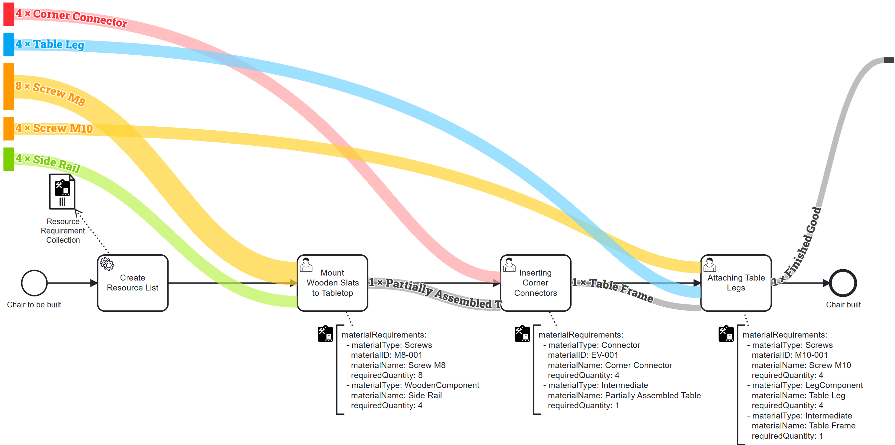

# PRiME Material Flow

A Camunda plugin for visualizing material flows in business processes, part of PRiME (Passive Resource-integrated Modeling Extension) extension.

## Overview



PRiME Material Flow is a visualization tool that bridges the gap between digital process models and physical resource orchestration in Business Process Management (BPM). It extends Camunda's capabilities to provide:

- Visualization of material flows in business processes
- Design-time analysis of material requirements
- Clear representation of material consumption and production
- Support for tracking both consumable materials and reusable tools

## Features

- **Material Flow Visualization**: Interactive Sankey diagrams showing material movement through process tasks
- **Resource Management**: Track both consumable materials and reusable tools
- **Design-Time Analysis**: Identify material requirements and dependencies before execution
- **Camunda Integration**: Seamlessly integrates with Camunda Cockpit
- **Flexible Annotation**: Supports both JSON and YAML formats for material specifications
- **Quantitative Evaluation**: Built-in tests for performance benchmarking with statistical analysis

## Technology Stack

- **Framework**: Spring Boot 3.5.10 with Kotlin
- **BPMN Engine**: Camunda 7.24.0
- **Build System**: Gradle with version catalog
- **Testing**: JUnit 5 with warmup iterations for reliable measurements

## Installation

1. Clone this repository
2. Start the application
    ```bash
    ./gradlew bootRun
    ```
3. Open Camunda Cockpit at http://localhost:8080/ (admin:admin) and navigate to deployed processes 

## Usage

1. Annotate your BPMN processes with material requirements using the PRiME extension
2. Deploy your process to Camunda
3. Access the Material Flow visualization through the Camunda Cockpit

### Example Material Annotation

```json
{
  "resourceRequirements": [
    {
      "resourceType": "Tool",
      "resourceName": "Miter Saw",
      "requiredQuantity": 1,
      "unitOfMeasurement": "pieces"
    },
    {
      "resourceType": "RawMaterial",
      "resourceName": "Douglas Fir 2x4",
      "requiredQuantity": 20,
      "unitOfMeasurement": "meters"
    },
    {
      "resourceType": "Consumable",
      "resourceName": "Wood Screws 50mm",
      "requiredQuantity": 200,
      "unitOfMeasurement": "pieces"
    }
  ]
}
```

### Resource Types

The annotation system supports five resource types:
- **Tool**: Reusable equipment (saws, drills, lifts)
- **Equipment**: Heavy machinery (forklifts, hoists)
- **RawMaterial**: Base materials (lumber, steel, concrete)
- **Consumable**: Single-use items (screws, nails, washers)
- **Connector**: Hardware components (brackets, straps)

## Repository Structure

```
src/
├── main/
│   ├── kotlin/de/ur/operational/
│   │   ├── Controller.kt         # REST API endpoints for the material flow visualization
│   │   │   - getTaskOrder()      # Returns the order of tasks from BPMN
│   │   │   - getSankeyData()     # Generates data for the Sankey diagram
│   │   │   - getMaterialRequirements() # Extracts material requirements from BPMN
│   │   │
│   │   ├── MaterialService.kt   # Handles parsing of material requirements (JSON/YAML)
│   │   ├── ModelService.kt      # Manages BPMN model operations
│   │   ├── SankeyService.kt     # Generates Sankey diagram data
│   │   └── BpmnProcessor.kt     # Processes BPMN files to extract task flows
│   │
│   ├── resources/
│   │   ├── processes/
│   │   │   ├── MaterialFlow.bpmn       # Table building process (YAML annotations)
│   │   │   ├── TrussPrefabrication.bpmn # Truss prefabrication (JSON annotations)
│   │   │   └── TrussPrefabricationLong.bpmn # Large-scale synthetic process
│   │   └── META-INF/resources/webjars/camunda/app/cockpit/scripts/
│   │       └── sankey-plugin/    # Contains frontend plugin including package.json and node_modules
│   │           └── sankey-plugin.js  # D3.js based Sankey diagram implementation
│   │
│   └── test/kotlin/de/ur/operational/
│       ├── QuantitativeEvaluationTest.kt  # Performance benchmarking (10 runs, mean ± SD)
│       └── ScalabilityEvaluationTest.kt   # Scalability analysis (10-500 tasks)
└── build/scripts/
    └── scalability-plot.R         # R script for generating scalability plots
```

### Key Components

1. **sankey-plugin.js**
   - Implements the D3.js based Sankey diagram visualization
   - Integrates with Camunda Cockpit
   - Handles rendering of material flows between tasks

2. **BPMN Test Processes**
   - `MaterialFlow.bpmn`: Table building process with YAML annotations
   - `TrussPrefabrication.bpmn`: Truss prefabrication with JSON annotations
   - `TrussPrefabricationLong.bpmn`: Large-scale process for stress testing

3. **Backend Services**
   - `MaterialService`: Parses material requirements from BPMN annotations (supports JSON and YAML)
   - `ModelService`: Manages BPMN model operations and task ordering
   - `SankeyService`: Transforms process data into Sankey diagram format

## Evaluation

The project includes built-in quantitative evaluation tests:

### Running Performance Tests

```bash
# Run quantitative evaluation (3 processes, 10 iterations each, 5 warmup)
./gradlew test --tests QuantitativeEvaluationTest

# Run scalability analysis (synthetic data: 10, 50, 100, 200, 500 tasks)
./gradlew test --tests ScalabilityEvaluationTest

# Generate R plot from scalability results
Rscript build/scripts/scalability-plot.R
```

### Output

- `build/reports/quantitative-evaluation.csv`: Performance metrics for each process
- `build/reports/scalability-evaluation.csv`: Scalability data across task counts

The tests use warmup iterations (5) before measurement runs (10) to ensure reliable timing data by forcing JIT compilation and class loading.

## Resource API

The application provides a REST API for managing resource inventory during process execution:

### Update Resource Inventory

```bash
curl -X POST http://localhost:8080/api/resources/inventory/update \
  -H "Content-Type: application/json" \
  -d '{"resources":[{"resourceName":"Screw M8","resourceId":"M8-001","quantity":20,"unitOfMeasurement":"pieces","type":"Screws"}]}'
```

### Get Current Resource Inventory

```bash
curl http://localhost:8080/api/resources/inventory
```

## License

This project is licensed under the MIT License - see the [LICENSE](LICENSE) file for details.